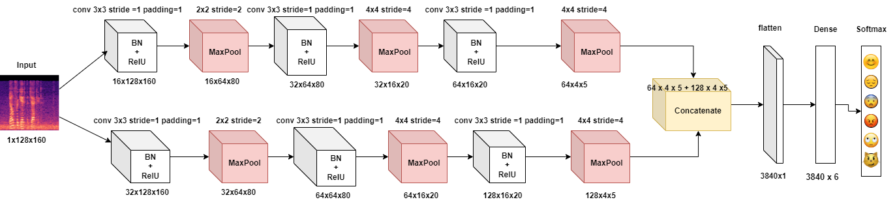
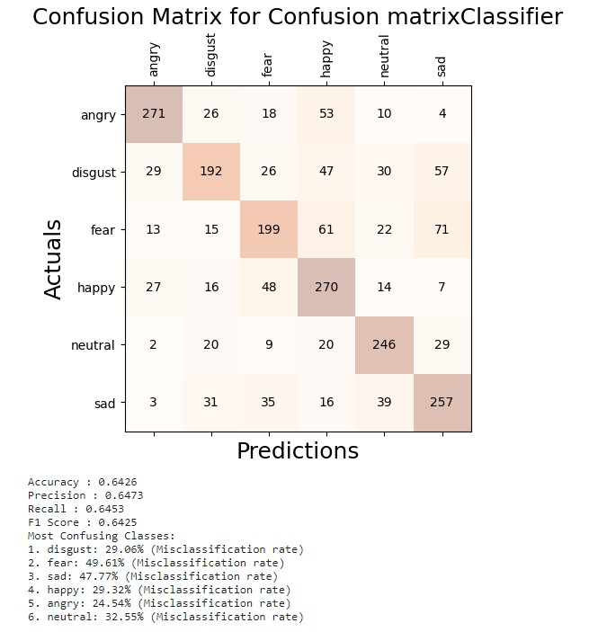

# Speech-Emotion-Recognition Using 2  CNN models with 2-D convolution 
# Architecture

# Model 1
* 2 Parallel CNNs

1. AlexNet laid the groundwork for enhancing feature maps by stacking CNN layers and expanding channels.
2. Inception and GoogLeNet introduced the idea of parallelizing CNN layers to diversify the learned features.
3. VGGNet demonstrated the effectiveness of using fixed-sized kernels that we use in each parallel network.
4. LeNet architecture inspired the sequence of operations: Convolutional layer, pooling layer, convolutional layer, pooling layer and a fully connected layer.

# Results  Accuracy : 64.26 %

# Model 2
* 2 Parallel CNNs + Transformer Encoder
1. Transformer-Encoder layer from the Attention is All You Need paper

 Transformers allows for capturing both local and global dependencies in the input data. This flexibility enables the model to learn complex patterns and relationships at various scales, enhancing its ability to model intricate structures within the data.

# Results  Accuracy : 66.23 %

# References

1. Krizhevsky et al, 2017. ImageNet Classification with Deep Convolutional Neural Networks. https://papers.nips.cc/paper/4824-imagenet-classification-with-deep-convolutional-neural-networks.pdf
2. LeCunn et al, 1998. Gradient-Based Learning Applied to Document Recognition. http://yann.lecun.com/exdb/publis/pdf/lecun-01a.pdf
3. Simonyan and Zisserman, 2015. Very Deep Convolutional Networks for Large-Scale Image Recognition. https://arxiv.org/pdf/1409.1556.pdf
4. Vaswani et al, 2017. Attention Is All You Need. https://arxiv.org/abs/1706.03762
5. DFU_SPNet: A stacked parallel convolution layers based CNN to improve Diabetic Foot Ulcer classification https://www.sciencedirect.com/science/article/pii/S2405959521001120
6. An Image is Worth 16x16 Words: Transformers for Image Recognition at Scale https://arxiv.org/abs/2010.11929

